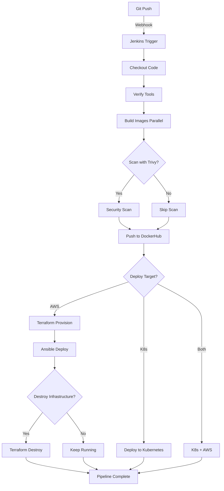

# 🚀 Jenkins Pipeline - Configuration Complète

## 📋 Vue d'ensemble

Le pipeline Jenkins intègre maintenant **Terraform** et **Ansible** pour automatiser le déploiement complet sur AWS EC2.

## 🎯 Fonctionnalités du Pipeline

### **Stages du Pipeline**

1. **🔄 Checkout** - Clone le repository GitHub
2. **✓ Verify Prerequisites** - Vérifie Docker, Trivy, kubectl, Terraform, Ansible
3. **🔨 Build Docker Images** - Build parallèle de 4 services
4. **🔍 Security Scan (Trivy)** - Scan de sécurité des images
5. **📤 Push to Registry** - Push vers DockerHub
6. **🚀 Deploy to Kubernetes** - Déploiement K8s (optionnel)
7. **🏗️ Terraform - Provision AWS** - Création de l'infrastructure AWS
8. **📦 Ansible - Deploy to AWS** - Installation et démarrage des services
9. **🗑️ Terraform Destroy** - Cleanup automatique (économie Free Tier)

---

## 🔑 Configuration Requise dans Jenkins

### **1. Credentials à créer**

Dans Jenkins → Manage Jenkins → Manage Credentials → Add Credentials :

#### **a) DockerHub Credentials**
```
ID: dockerhub-credentials
Type: Username with password
Username: saifdine23
Password: [DockerHub Access Token]
Description: DockerHub registry credentials
```

#### **b) AWS Access Key ID**
```
ID: aws-access-key-id
Type: Secret text
Secret: AKI***
Description: AWS Access Key ID
```

#### **c) AWS Secret Access Key**
```
ID: aws-secret-access-key
Type: Secret text
Secret: G+CuKfZ***
Description: AWS Secret Access Key
```

#### **d) Gemini API Key**
```
ID: gemini-api-key
Type: Secret text
Secret: [Votre clé Gemini API]
Description: Google Gemini API Key
```

---

### **2. Outils à installer sur Jenkins**

#### **a) Docker**
```bash
# Sur le serveur Jenkins
sudo yum install docker -y
sudo systemctl start docker
sudo systemctl enable docker
sudo usermod -aG docker jenkins
```

#### **b) Trivy (Security Scanner)**
```bash
wget https://github.com/aquasecurity/trivy/releases/download/v0.50.0/trivy_0.50.0_Linux-64bit.tar.gz
tar zxvf trivy_0.50.0_Linux-64bit.tar.gz
sudo mv trivy /usr/local/bin/
trivy --version
```

#### **c) Terraform**
```bash
wget https://releases.hashicorp.com/terraform/1.7.0/terraform_1.7.0_linux_amd64.zip
unzip terraform_1.7.0_linux_amd64.zip
sudo mv terraform /usr/local/bin/
terraform --version
```

#### **d) Ansible**
```bash
sudo yum install python3-pip -y
sudo pip3 install ansible
ansible --version
```

#### **e) kubectl**
```bash
curl -LO "https://dl.k8s.io/release/$(curl -L -s https://dl.k8s.io/release/stable.txt)/bin/linux/amd64/kubectl"
sudo install -o root -g root -m 0755 kubectl /usr/local/bin/kubectl
kubectl version --client
```

---

### **3. SSH Key pour AWS EC2**

Copier la clé privée EC2 sur le serveur Jenkins :

```bash
# Sur le serveur Jenkins
sudo su - jenkins
mkdir -p ~/.ssh
chmod 700 ~/.ssh

# Copier la clé (depuis votre machine locale)
scp ~/.ssh/ai-product-insights-key.pem jenkins@jenkins-server:~/.ssh/
chmod 600 ~/.ssh/ai-product-insights-key.pem
```

---

## 🎮 Utilisation du Pipeline

### **Paramètres disponibles**

| Paramètre | Type | Valeurs | Description |
|-----------|------|---------|-------------|
| `ACTION` | Choice | `Build & Push`<br>`Build & Push & Deploy K8s`<br>`Build & Push & Deploy AWS` | Action principale |
| `DEPLOY_TARGET` | Choice | `kubernetes`<br>`aws-ec2`<br>`both` | Cible de déploiement |
| `IMAGE_TAG` | String | `latest` (défaut) | Tag des images Docker |
| `PUSH_TO_REGISTRY` | Boolean | `true` | Push vers DockerHub |
| `SCAN_WITH_TRIVY` | Boolean | `true` | Scan de sécurité |
| `TERRAFORM_DESTROY` | Boolean | `false` | Destroy après déploiement |

---

### **Scénarios d'utilisation**

#### **Scénario 1 : Build + Push uniquement**
```yaml
ACTION: Build & Push
PUSH_TO_REGISTRY: true
SCAN_WITH_TRIVY: true
TERRAFORM_DESTROY: false
```
✅ Build les images → Scan → Push vers DockerHub

---

#### **Scénario 2 : Déploiement Kubernetes**
```yaml
ACTION: Build & Push & Deploy K8s
DEPLOY_TARGET: kubernetes
PUSH_TO_REGISTRY: true
SCAN_WITH_TRIVY: true
TERRAFORM_DESTROY: false
```
✅ Build → Scan → Push → Deploy sur cluster K8s

---

#### **Scénario 3 : Déploiement AWS EC2**
```yaml
ACTION: Build & Push & Deploy AWS
DEPLOY_TARGET: aws-ec2
PUSH_TO_REGISTRY: true
SCAN_WITH_TRIVY: true
TERRAFORM_DESTROY: false
```
✅ Build → Scan → Push → Terraform (infrastructure) → Ansible (déploiement)

---

#### **Scénario 4 : Test rapide avec cleanup automatique**
```yaml
ACTION: Build & Push & Deploy AWS
DEPLOY_TARGET: aws-ec2
PUSH_TO_REGISTRY: true
SCAN_WITH_TRIVY: false  # Accélérer le build
TERRAFORM_DESTROY: true  # ⚠️ IMPORTANT: Destroy après
```
✅ Build → Push → Deploy AWS → **Destroy automatique** (économie Free Tier)

---

## 📊 Flux du Pipeline



---

## ⚙️ Configuration Jenkins Job

### **1. Créer un Pipeline Job**

1. Jenkins → New Item
2. Nom: `ai-product-insights-pipeline`
3. Type: **Pipeline**
4. OK

### **2. Configuration du Job**

#### **General**
- ✅ GitHub project: `https://github.com/SAIFDINE23/ai-product-insights-platform`
- ✅ Discard old builds: Keep last 30 builds

#### **Build Triggers**
- ✅ GitHub hook trigger for GITScm polling
- ✅ Poll SCM: `H/5 * * * *` (vérifier toutes les 5 min)

#### **Pipeline**
- Definition: **Pipeline script from SCM**
- SCM: **Git**
- Repository URL: `https://github.com/SAIFDINE23/ai-product-insights-platform.git`
- Credentials: [Votre GitHub Personal Access Token]
- Branch: `*/main`
- Script Path: `Jenkinsfile`

---

## 🔔 Webhook GitHub (Déclenchement automatique)

### **Configuration GitHub**

1. GitHub Repository → Settings → Webhooks → Add webhook
2. Payload URL: `http://[JENKINS_URL]/github-webhook/`
3. Content type: `application/json`
4. Events: `Just the push event`
5. Active: ✅

Maintenant, chaque `git push` déclenche automatiquement le pipeline!

---

## 🧪 Test du Pipeline

### **Test manuel**

1. Jenkins → ai-product-insights-pipeline → Build with Parameters
2. Sélectionner les paramètres
3. Build

### **Test automatique (Git push)**

```bash
cd /home/saif/projects/Product_Insights
git add .
git commit -m "test: trigger jenkins pipeline"
git push origin main
```

---

## 📈 Résultats Attendus

### **Après un déploiement AWS réussi :**

```
✅ Infrastructure créée (VPC, Subnet, EC2)
✅ EC2 Public IP: 34.xxx.xxx.xxx
✅ Docker + Docker Compose installés
✅ Images pullées depuis DockerHub
✅ Services démarrés (PostgreSQL, Backend, Frontend)
✅ Frontend accessible: http://34.xxx.xxx.xxx
✅ API Backend: http://34.xxx.xxx.xxx:8000
```

### **Dans les logs Jenkins :**

```
═══════════════════════════════════════════════════════
✓ APPLICATION DEPLOYED SUCCESSFULLY
✓ Frontend URL: http://34.xxx.xxx.xxx
✓ Backend API: http://34.xxx.xxx.xxx:8000
═══════════════════════════════════════════════════════
```

---

## 🐛 Troubleshooting

### **Erreur : "Docker login failed"**
→ Vérifier les credentials `dockerhub-credentials` dans Jenkins

### **Erreur : "AWS credentials not found"**
→ Vérifier `aws-access-key-id` et `aws-secret-access-key`

### **Erreur : "Terraform command not found"**
→ Installer Terraform sur le serveur Jenkins

### **Erreur : "SSH connection refused"**
→ Attendre 60-90s que l'instance EC2 soit complètement démarrée

### **Erreur : "Permission denied (publickey)"**
→ Vérifier que la clé SSH est dans `~/.ssh/` avec les bonnes permissions (600)

---

## 💰 Économies Free Tier

Pour éviter de consommer votre Free Tier AWS :

1. **Option 1 : Destroy manuel**
   ```bash
   cd infrastructure/terraform
   terraform destroy -var-file=terraform.tfvars -auto-approve
   ```

2. **Option 2 : Destroy automatique dans Jenkins**
   - Cocher `TERRAFORM_DESTROY = true` avant le build
   - Le pipeline détruira l'infrastructure automatiquement après déploiement

3. **Option 3 : Cron Job Jenkins**
   - Créer un job séparé qui destroy chaque soir à 22h
   - Cron: `0 22 * * *`

---

## 📚 Ressources

- [Jenkinsfile](./Jenkinsfile)
- [Terraform Configuration](./infrastructure/terraform/)
- [Ansible Playbook](./infrastructure/ansible/playbook.yml)
- [Deployment Guide](./infrastructure/DEPLOYMENT_GUIDE.md)

---

## ✅ Checklist de Configuration

- [ ] Jenkins installé et configuré
- [ ] Docker installé sur Jenkins
- [ ] Trivy installé
- [ ] Terraform installé
- [ ] Ansible installé
- [ ] kubectl installé
- [ ] Credentials DockerHub créées
- [ ] Credentials AWS créées
- [ ] Credentials Gemini API créées
- [ ] SSH Key EC2 copiée
- [ ] Pipeline Job créé
- [ ] GitHub Webhook configuré
- [ ] Test manuel réussi
- [ ] Test automatique (git push) réussi

---

**🎉 Félicitations! Votre pipeline CI/CD complet est opérationnel!**
